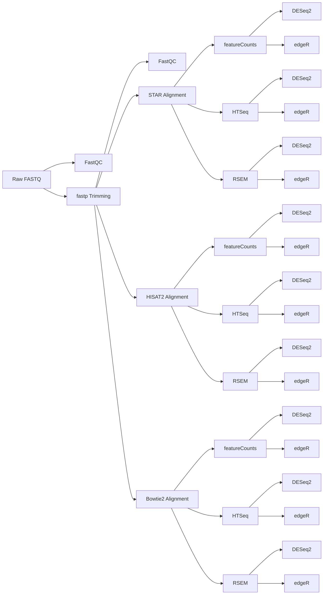

# RnaSeqMetaAnalyst


# RNA-Seq Meta-Analyst Pipeline

A comprehensive, containerized RNA-seq analysis pipeline that performs alignment, quantification, differential expression analysis, and pipeline comparison across multiple tools.

[](https://www.docker.com/)
[](LICENSE)
[]()

## 🎯 Overview

This pipeline provides a complete solution for RNA-seq data analysis, offering:

- **Multiple Aligners**: STAR, HISAT2, Bowtie2
- **Multiple Quantifiers**: featureCounts, HTSeq, RSEM
- **Multiple DEG Tools**: DESeq2, edgeR
- **Comprehensive QC**: FastQC, fastp, MultiQC
- **Pipeline Comparison**: Cross-tool correlation analysis

**Key Features:**
- 🐳 Fully containerized (Docker)
- 🔄 Reproducible results across platforms
- 📊 Generates 16 different pipeline combinations
- 🎨 Publication-ready visualizations
- ⚡ Parallel processing for faster execution
- 📝 Comprehensive logging and error handling

---

##  Table of Contents

- [Prerequisites](#prerequisites)
- [Installation](#installation)
- [Quick Start](#quick-start)
- [Directory Structure](#directory-structure)
- [Pipeline Stages](#pipeline-stages)
- [Usage](#usage)
- [Output Files](#output-files)
- [Advanced Options](#advanced-options)

---

##  Prerequisites

### System Requirements
- **OS**: Linux, macOS, or Windows (with WSL2)
- **RAM**: Minimum 16 GB (32 GB recommended)
- **CPU**: Minimum 8 cores (16+ recommended)
- **Storage**: 50-100 GB free space (depending on dataset size)
- **Docker**: Version 20.10 or higher

### Software Dependencies
All dependencies are included in the Docker container:
- Python 3.11
- R 4.2.3
- Bioconda packages (STAR, HISAT2, Bowtie2, etc.)

---

## Installation

### Step 1: Clone the Repository
```bash
git clone https://github.com/bioinfokushwaha/RnaSeqMetaAnalyst.git
cd RnaSeqMetaAnalyst/bioinfo_pipeline
```

### Step 2: Build the Docker Image
This process builds the Docker image with all necessary environments and tools. It may take 20-40 minutes.
```bash
docker build -t rnaseqmetaanalyst:latest .
```


### 3. Verify Installation

```bash
 docker run -it --rm --entrypoint /bin/bash rnaseqmetaanalyst:latest
```
## Loading a Docker Image from a `.tar.gz` Archive
Download the Docker image:

[rnaseqmetaanalyst.tar.gz](https://drive.google.com/file/d/1nVWHJkDYgihPhgP9TKt60psnyNmXMLcI/view?usp=sharing)

Use the rnaseqmetaanalyst.tar.gz file (`rnaseqmetaanalyst.tar.gz`), follow these steps to load it into Docker.

### Step 1: Decompress the Archive

```bash
gunzip rnaseqmetaanalyst.tar.gz
```

This will produce:

```bash
rnaseqmetaanalyst.tar
```

Alternatively, you can extract and load in a single command:

```bash
gunzip -c rnaseqmetaanalyst.tar.gz > rnaseqmetaanalyst.tar
```

### Step 2: Load the Docker Image

```bash
docker load -i rnaseqmetaanalyst.tar
```

Expected output:

```text
Loaded image: rnaseqmetaanalyst:latest
```

### Step 3: Verify the Image

```bash
docker images
```

You should see:

```text
REPOSITORY          TAG       IMAGE ID       CREATED
rnaseqmetaanalyst   latest    <image_id>     <date>
```

### Step 4: Run the Container

```bash
docker run --rm rnaseqmetaanalyst:latest
```

To open an interactive shell inside the container:

```bash
docker run -it --rm --entrypoint /bin/bash rnaseqmetaanalyst:latest
```

If Bash is unavailable:

```bash
docker run -it --rm --entrypoint /bin/sh rnaseqmetaanalyst:latest
```

---

## Quick Start

### Prepare Your Data

1. **Create project directory structure:**

```bash
mkdir -p my_project/data/raw
mkdir -p my_project/data/genome
```

2. **Add your files:**

```
my_project/
├── data/
│   ├── raw/                      # FASTQ files
│   │   ├── sample1_1.fastq.gz
│   │   ├── sample1_2.fastq.gz
│   │   ├── sample2_1.fastq.gz
│   │   └── sample2_2.fastq.gz
│   ├── genome/                   # Reference genome
│   │   ├── genome.fna            # Genome FASTA
│   │   ├── annotation.gtf        # Gene annotation
│   │   └── annotation.gff        # Gene annotation
│   └── sampleinfo.txt            # Sample metadata
└── results/                      # Will be created by pipeline
```

3. **Create sampleinfo.txt:**

```tsv
SampleName      CONDITION
sample1	control
sample2	control
sample3	treated
sample4	treated
```

**Important**: Use **tab-separated** values (TSV format), not spaces.

### Run the Pipeline

```bash
cd my_project
bash /path/to/run_pipeline.sh --project-dir $(pwd) --mode PE
```
**For better understanding of paremeters go through 'run_pipeline.sh' where you add multiple parameters**
**That's it!** The pipeline will:
1. Perform quality control
2. Align reads with 3 different aligners
3. Quantify expression with 3 different methods
4. Perform differential expression analysis
5. Generate comparison reports

---

##  Directory Structure

### Input Structure

```
project/
├── data/
│   ├── raw/                          # Raw FASTQ files
│   │   ├── sample1_1.fastq.gz       # R1 for paired-end
│   │   ├── sample1_2.fastq.gz       # R2 for paired-end
│   │   └── ...
│   ├── genome/                       # Reference genome files
│   │   ├── *.fna|*.fa|*.fasta       # Genome sequence
│   │   ├── *.gtf                     # Gene annotation (GTF)
│   │   └── *.gff|*.gff3             # Gene annotation (GFF)
│   ├── sampleinfo.xlsx              # Sample metadata
│   └── housekeeping_genes.xlsx      # Optional housekeeping genes for normalization/QC
│
└── results/                          # Output directory (created automatically)
```

### Output Structure

```
results/
├── qc/                               # Quality control reports
│   ├── fastqc_raw/                  # FastQC before trimming
│   ├── fastqc_clean/                # FastQC after trimming
│   ├── fastp_reports/               # fastp HTML reports
│   └── multiqc/                     # MultiQC summary
├── Trim/                            # Trimmed FASTQ files
├── Mapping/                         # Alignment outputs
│   ├── Bowtie/                      # Bowtie2 BAM files
│   ├── Hisat2/                      # HISAT2 BAM files
│   └── STAR/                        # STAR BAM files
├── Quantification/                  # Count matrices
│   ├── Bowtie/
│   │   ├── FC/                      # featureCounts
│   │   ├── HT/                      # HTSeq
│   │   └── RSEM/                    # RSEM
│   ├── Hisat2/
│   │   ├── FC/
│   │   └── HT/
│   └── STAR/
│       ├── FC/
│       ├── HT/
│       └── RSEM/
├── DEG/                             # Clean count matrices
│   ├── *_clean.txt                  # Cleaned matrices
│   └── sampleinfo.txt               # Sample metadata copy
├── results/
│   ├── DEG/                         # Differential expression results
│   │   ├── B_FC_counts_clean/       # Bowtie2 + FC results
│   │   │   ├── *_edgeR_UP.xlsx
│   │   │   ├── *_edgeR_DOWN.xlsx
│   │   │   ├── *_DESeq2_UP.xlsx
│   │   │   ├── *_DESeq2_DOWN.xlsx
│   │   │   ├── *_PCA_Plot.png
│   │   │   └── *_Volcano.png
│   │   └── ... (16 combinations total)
│   └── pipeline_comparison/         # Cross-pipeline analysis
│       ├── upregulated_genes_heatmap.png
│       ├── downregulated_genes_heatmap.png
│       ├── *_correlation.png
│       └── *.xlsx
└── logs/                            # Execution logs
```

---

## Pipeline Stages

### Stage 1: Quality Control & Alignment



**Tools Used:**
- **QC**: FastQC, fastp, MultiQC
- **Aligners**: STAR, HISAT2, Bowtie2
- **Quantifiers**: featureCounts, HTSeq, RSEM

**Combinations Generated**: 8 count matrices
- Bowtie2 + featureCounts
- Bowtie2 + HTSeq
- Bowtie2 + RSEM
- HISAT2 + featureCounts
- HISAT2 + HTSeq
- STAR + featureCounts
- STAR + HTSeq
- STAR + RSEM

### Stage 2: Differential Expression Analysis

**Tools Used:**
- DESeq2 (variance-stabilizing transformation)
- edgeR (trimmed mean of M-values normalization)

**For Each Count Matrix:**
- Normalized counts
- PCA plots
- Volcano plots
- UP-regulated genes (Excel)
- DOWN-regulated genes (Excel)
- Summary statistics

**Total Combinations**: 16 (8 matrices × 2 DEG tools)

### Stage 3: Pipeline Comparison

**Analyses:**
1. **Non-zero gene counts** across samples
2. **UP-regulated genes** overlap matrix
3. **DOWN-regulated genes** overlap matrix
4. **Correlation heatmaps** between pipelines
5. **Summary statistics** and reports

---

## 💻 Usage

### Basic Usage

```bash
./run_pipeline.sh --project-dir <path> --mode <SE|PE>
```

### Common Commands

#### Full Pipeline (Paired-End)
```bash
./run_pipeline.sh --project-dir $(pwd) --mode PE
```

#### Full Pipeline (Single-End)
```bash
./run_pipeline.sh --project-dir $(pwd) --mode SE
```

#### Run Only DEG Analysis
```bash
./run_pipeline.sh --project-dir $(pwd) --mode PE --deg-only
```

#### Run Only Comparison
```bash
./run_pipeline.sh --project-dir $(pwd) --mode PE --comparison-only
```
#### Run Busco Analysis to generate Housekeeping Genes
Assume using Mammalian Genome
```bash
./run_pipeline1.sh --project-dir $(pwd) --busco --protein data/genome/protein.faa --lineage mammalia_odb12
```

#### Custom DEG Thresholds
```bash
./run_pipeline.sh \
  --project-dir $(pwd) \
  --mode PE \
  --log2fc 1.5 \
  --fdr 0.01 \
  --pvalue 0.01
```

#### Skip Specific Stages
```bash
# Skip comparison analysis
./run_pipeline.sh --project-dir $(pwd) --mode PE --skip-comparison

# Skip DEG analysis
./run_pipeline.sh --project-dir $(pwd) --mode PE --skip-deg

# Skip alignment (requires existing count matrices)
./run_pipeline.sh --project-dir $(pwd) --mode PE --skip-alignment
```

### Options Reference

| Option | Description | Default |
|--------|-------------|---------|
| `--project-dir` | Project directory path (required) | - |
| `--mode` | Sequencing mode: SE or PE (required) | - |
| `--threads` | Number of CPU threads | 8 |
| `--log2fc` | Log2 fold change threshold | 1 |
| `--fdr` | False discovery rate threshold | 0.05 |
| `--pvalue` | P-value threshold | 0.05 |
| `--sjdb-overhang` | STAR parameter (read length - 1) | 100 |
| `--skip-alignment` | Skip alignment stage | false |
| `--skip-deg` | Skip DEG analysis | false |
| `--skip-comparison` | Skip comparison stage | false |
| `--deg-only` | Only run DEG analysis | false |
| `--comparison-only` | Only run comparison | false |
| `--detached` | Run in background | false |
| `--index-dir` | Pre-built indices directory | - |

---

## Output Files

### Quality Control

- `multiqc_report.html` - Comprehensive QC summary
- `fastp_reports/*.html` - Per-sample QC reports
- `fastqc_raw/` - Pre-trimming QC
- `fastqc_clean/` - Post-trimming QC

### Alignment

- `*_sorted.bam` - Sorted BAM files
- `*_sorted.bam.bai` - BAM index files
- `*.log` - Alignment statistics

### Count Matrices

- `*_counts_clean.txt` - Cleaned count matrices (CSV format)
- One file per aligner-quantifier combination

### DEG Results

**Per Pipeline Combination:**
- `*_UP.xlsx` - Upregulated genes
- `*_DOWN.xlsx` - Downregulated genes
- `*_Normalized.xlsx` - Normalized counts
- `*_PCA_Plot.png` - Principal component analysis
- `*_PCA_Scores.xlsx` - PCA coordinates
- `*_Volcano.png` - Volcano plot
- `*_DEG_Summary.xlsx` - Summary statistics

**Columns in DEG Files:**
- Gene ID
- Log2 fold change
- P-value
- Adjusted p-value (FDR)
- Base mean / CPM
- Status (UP/DOWN/NS)

### Comparison Analysis

- `upregulated_genes_comparison_matrix.xlsx` - UP gene overlaps
- `downregulated_genes_comparison_matrix.xlsx` - DOWN gene overlaps
- `upregulated_genes_heatmap.png` - UP genes heatmap
- `downregulated_genes_heatmap.png` - DOWN genes heatmap
- `*_correlation.png` - Correlation heatmaps
- `nonzero_gene_counts_by_sample.xlsx` - Gene detection rates
- `analysis_summary.txt` - Summary report

---

## Advanced Options

### Using Pre-built Indices

If you have pre-built genome indices, you can skip the indexing step:

```bash
./run_pipeline.sh \
  --project-dir $(pwd) \
  --mode PE \
  --index-dir /path/to/indices
```

**Expected index structure:**
```
indices/
├── Bowtie/
│   └── genome.*
├── Hisat2/
│   └── genome.*
├── STAR/
│   └── genome/
└── RSEM/
    ├── Bowtie/
    │   └── rsem_ref.*
    └── STAR/
        └── rsem_ref.*
```

### Running in Background

For long-running analyses:

```bash
./run_pipeline.sh \
  --project-dir $(pwd) \
  --mode PE \
  --detached
```

Monitor progress:
```bash
# View container logs
docker logs -f <container_id>

# Or view log file
tail -f results/pipeline_run.log
```

### Custom Resource Allocation

```bash
# Use 16 threads
./run_pipeline.sh --project-dir $(pwd) --mode PE --threads 16

# With memory limit (via Docker)
docker run --cpus=16 --memory=32g ...
```

### Pipeline Codes

Each pipeline combination is assigned a 3-letter code:

**Format**: `[Aligner][Quantifier][DEG Tool]`

**Aligners:**
- `B` = Bowtie2
- `H` = HISAT2
- `S` = STAR

**Quantifiers:**
- `F` = featureCounts
- `H` = HTSeq
- `R` = RSEM

**DEG Tools:**
- `E` = edgeR
- `D` = DESeq2

**Examples:**
- `BFE` = Bowtie2 + featureCounts + edgeR
- `SRD` = STAR + RSEM + DESeq2
- `HHE` = HISAT2 + HTSeq + edgeR

---

## Troubleshooting

### Possible Docker Releated Issues

#### 1. Docker Permission Denied

**Error:**
```
Got permission denied while trying to connect to the Docker daemon socket
```

**Solution:**
```bash
# Add user to docker group
sudo usermod -aG docker $USER

# Log out and back in, or run:
newgrp docker
```

#### 2. Out of Memory

**Error:**
```
Container killed due to memory limit
```

**Solution:**
```bash
# Increase Docker memory limit
# For Docker Desktop: Settings → Resources → Memory

# Or reduce thread count
./run_pipeline.sh --project-dir $(pwd) --mode PE --threads 4
```

#### 3. Missing sampleinfo.txt

**Error:**
```
ERROR: sampleinfo.txt not found
```

**Solution:**
- Ensure file exists at `data/sampleinfo.txt`
- Check format (tab-separated, not space-separated)
- Verify file permissions

#### 4. No DEG Results

**Issue:** DEG analysis completes but no results files

**Possible causes:**
- No genes pass thresholds
- Sample size too small
- Low sequencing depth

**Solution:**
```bash
# Try more lenient thresholds
./run_pipeline.sh \
  --project-dir $(pwd) \
  --mode PE \
  --log2fc 0 \
  --fdr 0.1
```

#### 5. Alignment Fails

**Check logs:**
```bash
cat results/logs/star_*.log
cat results/logs/hisat2_*.log
cat results/logs/bowtie_*.log
```

**Common causes:**
- Insufficient memory
- Corrupted FASTQ files
- Incorrect genome files

### Getting Help

1. **Check logs**: All execution logs are in `results/logs/`
2. **View container output**: `docker logs <container_id>`

---

## 📚 File Format Requirements

### FASTQ Files

**Paired-End:**
- Forward reads: `*_1.fastq.gz` or `*_R1.fastq.gz`
- Reverse reads: `*_2.fastq.gz` or `*_R2.fastq.gz`

**Single-End:**
- Files should NOT contain `_1`, `_2`, `_R1`, or `_R2` in names

### Genome Files

**Required:**
- Genome FASTA: `*.fna`, `*.fa`, or `*.fasta`
- GTF annotation: `*.gtf`
- GFF annotation: `*.gff` or `*.gff3`

**Notes:**
- Files can be gzipped (`.gz` extension)
- Must be in the same directory
- Only one file of each type should be present

### Sample Info File

**Format**: Tab-separated values (TSV)

**Required columns:**
- `Sample`: Sample names (must match FASTQ file prefixes)
- `Condition`: Experimental conditions

**Example:**
```tsv
SampleName      CONDITION
Sample1     Control
Sample2     Control
Sample3     Control
Sample4     Treatment
Sample5     Treatment
Sample6     Treatment
```

**Important:**
- Use tabs, not spaces
- Sample names must exactly match FASTQ prefixes
- At least 2 conditions required
- At least 2 replicates per condition recommended

---

## 🔄 Pipeline Workflow Details

### Quality Control (Stage 1.1)

1. **FastQC** (raw reads)
   - Read quality assessment
   - Adapter detection
   - GC content distribution

2. **fastp** (trimming)
   - Adapter removal
   - Quality filtering
   - Length filtering
   - Automatic detection of adapters

3. **FastQC** (trimmed reads)
   - Post-trimming quality check

4. **MultiQC** (summary)
   - Aggregates all QC reports
   - Interactive HTML dashboard

### Alignment (Stage 1.2)

**Runs in parallel (3 aligners simultaneously):**

1. **STAR** (2-pass alignment)
   - Splice-aware aligner
   - Best for: Detection of novel junctions
   - Output: Sorted BAM files

2. **HISAT2**
   - Fast splice-aware aligner
   - Best for: Large datasets
   - Output: Sorted BAM files

3. **Bowtie2**
   - General-purpose aligner
   - Best for: Non-spliced alignments
   - Output: Sorted BAM files

### Quantification (Stage 1.3)

**For each aligner:**

1. **featureCounts**
   - Fast, counts at exon level
   - Handles multi-mapping reads
   - Gene-level summarization

2. **HTSeq**
   - Python-based counter
   - Flexible counting modes
   - Union mode (default)

3. **RSEM** (STAR and Bowtie2 only)
   - Transcript-level quantification
   - Handles isoform abundance
   - Expectation-maximization algorithm

### DEG Analysis (Stage 2)

**For each count matrix:**

1. **Normalization**
   - DESeq2: Variance-stabilizing transformation
   - edgeR: TMM normalization

2. **Differential Expression**
   - Pairwise comparisons between conditions
   - FDR correction (Benjamini-Hochberg)
   - Generates UP/DOWN gene lists

### DEG Thresholds

**Conservative (publication):**
```bash
--log2fc 1 --fdr 0.05
```

**Moderate (exploratory):**
```bash
--log2fc 0.5 --fdr 0.1
```

**Lenient (hypothesis generation):**
```bash
--log2fc 0 --fdr 0.1
```

---

### Comparison Analysis (Stage 3)
Generates excel file of pariwise comparision matrix and number of common DEGs in 16 rows cross 16 columns and also its images for both up and downregulated genes

---


## 🙏 Acknowledgments

- Bioconda community for tool packaging
- Docker community for containerization support
- All tool developers whose software powers this pipeline


[⬆ Back to top](#rna-seq-meta-analyst-pipeline)


